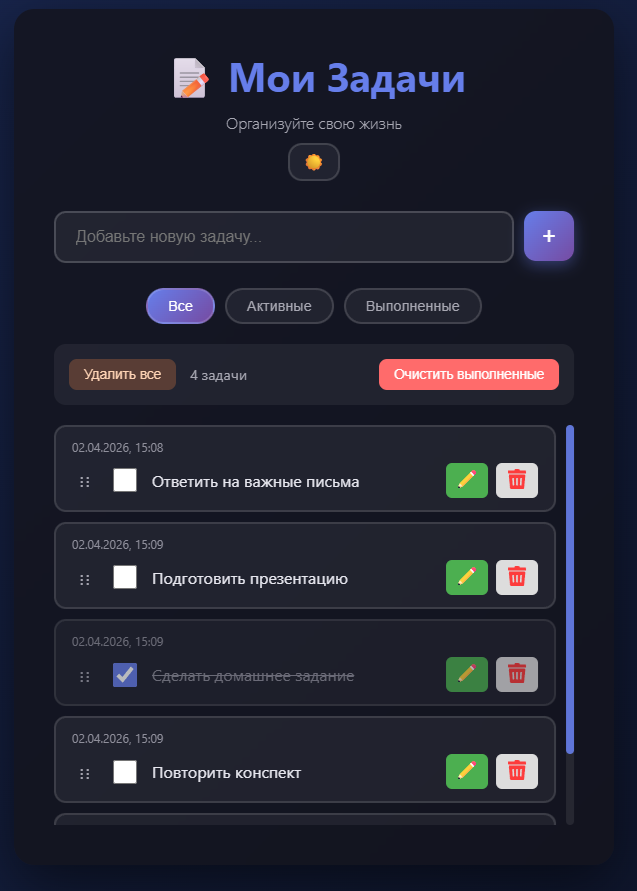
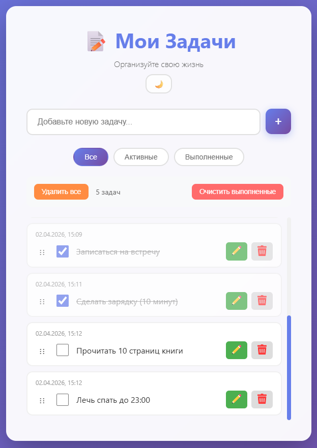

  

# ToDoWithAi (Todo List)

Это простой список задач с хранением данных в `localStorage` прямо в браузере. Приложение позволяет:

- добавлять задачи
- отмечать задачи выполненными
- редактировать текст задачи
- удалять задачи по одной
- сортировать задачи drag-and-drop (перетаскиванием за “ручку”)
- показывать дату/время создания каждой задачи сверху карточки
- фильтровать список: `Все`, `Активные`, `Выполненные`
- выбирать тему (тёмная/светлая) с сохранением в `localStorage`
- массовые действия с предупреждениями:
  - при клике `Очистить выполненные` показывается confirm
  - при клике `Удалить все` показывается confirm

## Где хранится состояние

Все задачи сохраняются в браузере в ключе `localStorage` под названием `tasks` (массив объектов с полями `id`, `text`, `completed`, `createdAt`).

## Как устроены файлы

- `index.html` — разметка страницы
- `css/style.css` — базовые стили (светлая тема)
- `css/theme.css` — стили тёмной темы
- `js/storage.js` — утилиты для работы с `localStorage`, датами и сортировкой
- `js/script.js` — основной код интерфейса (рендер задач, обработчики кликов, drag-and-drop)

